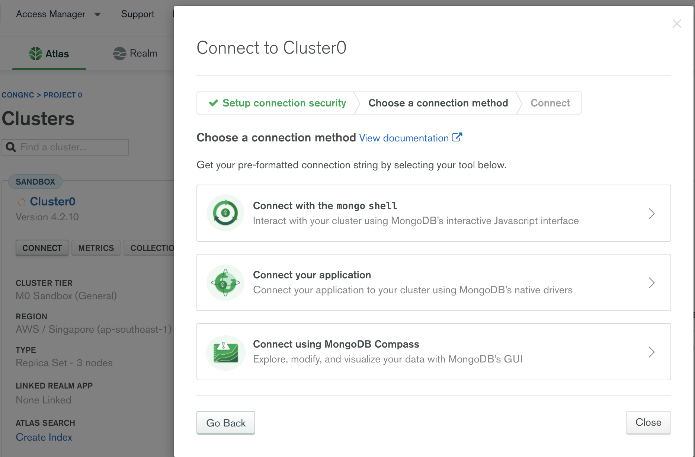
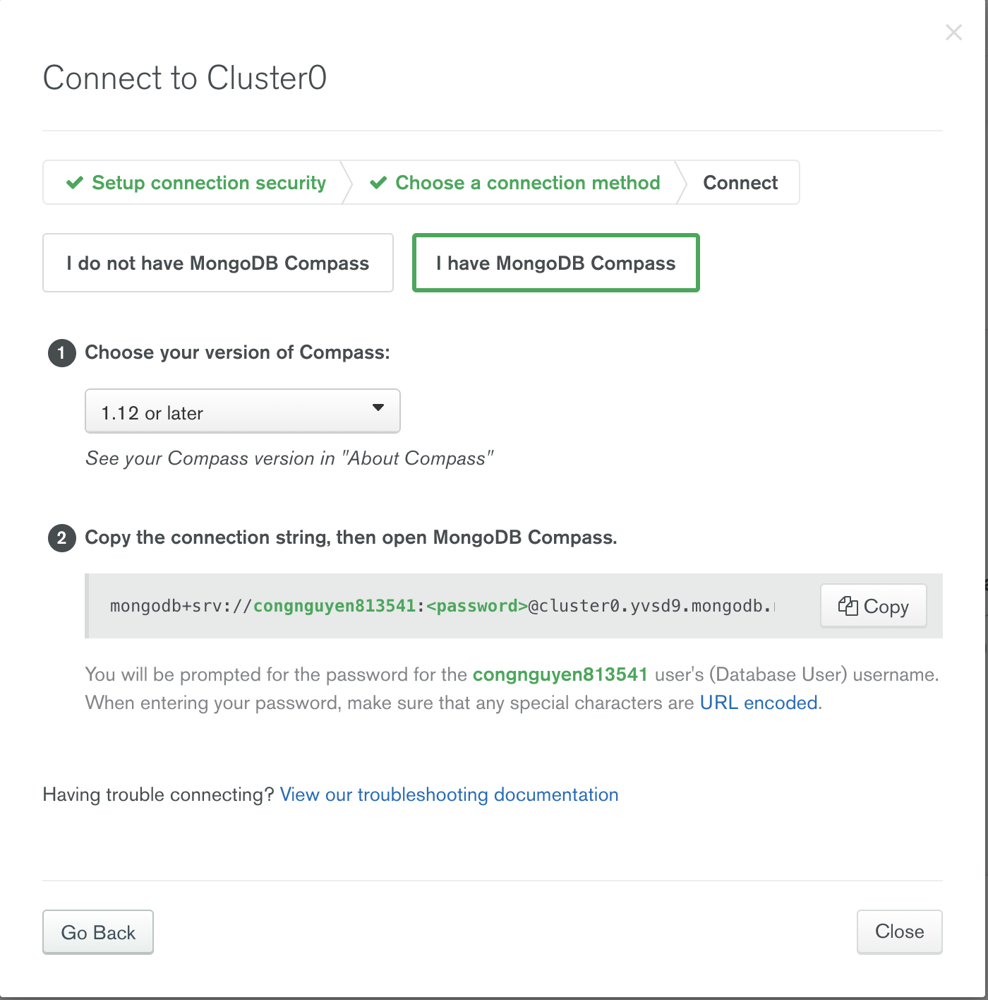

# Summary

## JS Array Functions

- **map()** => https://developer.mozilla.org/en-US/docs/Web/JavaScript/Reference/Global_Objects/Array/map
- **find()** => https://developer.mozilla.org/en-US/docs/Web/JavaScript/Reference/Global_Objects/Array/find
- **findIndex()** => https://developer.mozilla.org/en-US/docs/Web/JavaScript/Reference/Global_Objects/Array/findIndex
- **filter()** => https://developer.mozilla.org/en-US/docs/Web/JavaScript/Reference/Global_Objects/Array/filter
- **reduce()** => https://developer.mozilla.org/en-US/docs/Web/JavaScript/Reference/Global_Objects/Array/Reduce?v=b
- **concat()** => https://developer.mozilla.org/en-US/docs/Web/JavaScript/Reference/Global_Objects/Array/concat?v=b
- **slice()** => https://developer.mozilla.org/en-US/docs/Web/JavaScript/Reference/Global_Objects/Array/slice
- **splice()** => https://developer.mozilla.org/en-US/docs/Web/JavaScript/Reference/Global_Objects/Array/splice

---

## Plugin should have

1. **Bracket Pair** => This extension allows matching brackets to be identified with colours. The user can define which characters to match, and which colours to use.
2. **Code Spell Checker** => A basic spell checker that works well with camelCase code. The goal of this spell checker is to help catch common spelling errors while keeping the number of false positives low.
3. **Indent-rainbow** => This extension colorizes the indentation in front of your text alternating four different colors on each step. Some may find it helpful in writing code for Nim or Python.
4. **Material Icon Theme** => Get the Material Design icons into your VS Code.
5. **Path Intellisense** => Visual Studio Code plugin that autocompletes filenames.
6. **Visual Studio IntelliCode** => extension provides AI-assisted development features for Python, TypeScript/JavaScript and Java developers in Visual Studio Code, with insights based on understanding your code context combined with machine learning.
7. **Auto Rename Tag** => Automatically rename paired HTML/XML tag, same as Visual Studio IDE does.
8. **npm Intellisense** => Visual Studio Code plugin that autocompletes npm modules in import statements.
9. **Prettier** => Prettier is an opinionated code formatter. It enforces a consistent style by parsing your code and re-printing it with its own rules that take the maximum line length into account, wrapping code when necessary.
10. **ESLint**
11. **TODO Highlight** => Highlight TODO, FIXME and other annotations within your code.
12. **Image preview** => Shows image preview in the gutter and on hover

---

## Create Hosted MongoDB with Atlas

1. Go to [link](https://www.mongodb.com/cloud/atlas)
2. c\*1990@gmail.com - th\*81\*41
3. Download Compass App [link](https://www.mongodb.com/try/download/compass)
4. Connect
   
   

## Study flexbox by game
[link](https://flexboxfroggy.com/#vi)

## Some open-source projects that use Express:
1. [Builder Book](https://github.com/builderbook/builderbook): Open source web app to publish documentation or books. Built with React, Material-UI, Next, Express, Mongoose, MongoDB.
2. [SaaS Boilerplate](https://github.com/async-labs/saas): Open source web app to build your own SaaS product. Built with React, Material-UI, Next, MobX, Express, Mongoose, MongoDB, Typescript.
3. [BitMidi](https://bitmidi.com/): Open source web app powered by Express. BitMidi is a historical archive of MIDI files from the early web era. It uses the latest modern web technology including WebAssembly and Web Audio to bring MIDI back to life. [source code](https://github.com/feross/bitmidi.com)
