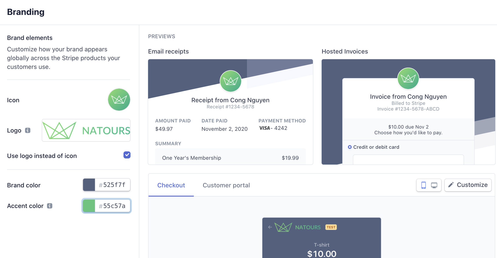
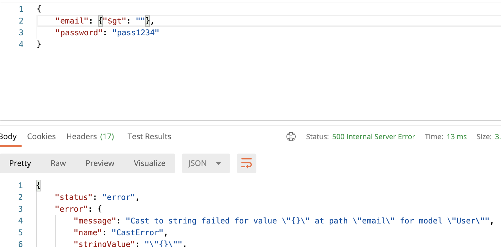
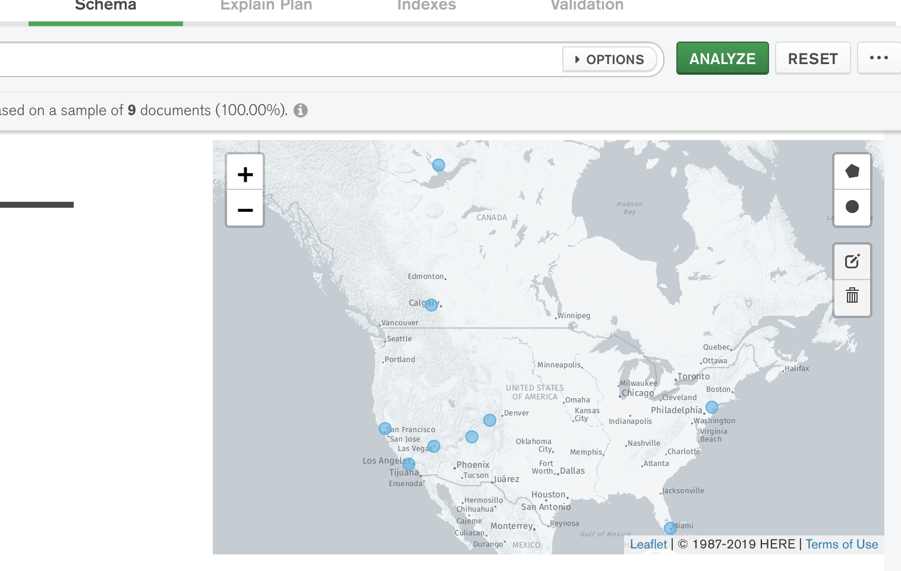

# Natours Application

Built using modern technologies: node.js, express, mongoDB, mongoose and friends 😁

## Import development data

```
node dev-data/data/import-dev-data.js --import
```

## Delete dev data

```
node dev-data/data/import-dev-data.js --delete
```

## Send Emails with Nodemailer

1. Go to [mailtrap](https://mailtrap.io)
2. Sign up with Github account
3. Using Sendgrid for 'Real' Emails

### Credit Card Payments with Stripe

1. [Register](https://dashboard.stripe.com/register)
2. cong\*2406@gmail.com - Th\*541
3. edit template stripe



### Data Sanitization



### Geospatial Queries



## Deploy to Heroku

Install Heroku Cli [link](https://devcenter.heroku.com/articles/heroku-cli)

```
brew tap heroku/brew && brew install heroku
heroku login
heroku create
git push heroku master
```

## Deploy Git subdirectory to Heroku

You might want to only deploy a subdirectory if the rest of the repo contains folders that are unrelated or unnecessary for your app to run.

### Heroku Setup

```
heroku login
heroku create
heroku git:remote -a my-app
```

p/s: my-app is name created by heroku create

### Git-subtree

Make sure to run this from the top level of the tree:

```
git subtree push --prefix path/to/subdirectory heroku master
```

For example, if the subdirectory I want to deploy my-app is in the root my-repo, then I run:

```
git subtree push --prefix my-app heroku master
```

### And then...

```
remote: Building source:
remote:
remote: -----> Node.js app detected
...
remote: Verifying deploy... done.
To https://git.heroku.com/my-app.git
```

### Config Environment

```
heroku config:set NODE_ENV=production
...
heroku open
heroku apps:rename natours
```
